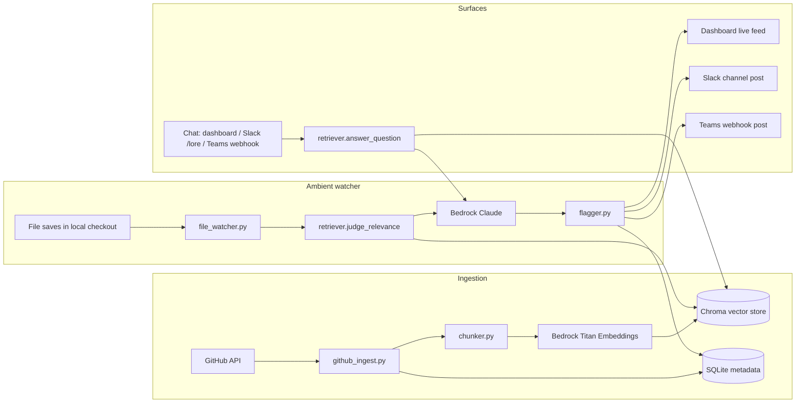

# Lore

**An ambient teammate that has read your team's entire engineering history — and speaks up when it matters.**

Every team loses knowledge constantly: the PR that reverted a "clever" optimization because it broke under load, the issue where three people argued about a retry strategy for two weeks, the commit message explaining why a hack exists. That knowledge lives in GitHub, not in anyone's head, and nobody re-reads history before making an edit.

Lore does. It continuously ingests a repo's commits, pull requests, and issues, indexes them semantically, and then does two things a one-shot AI coding assistant can't:

1. **Watches ambiently.** A background watcher monitors your working tree. When you edit a file, Lore checks whether your change collides with something in the repo's own history — and only speaks up when it's a genuine, specific collision (not vague similarity). It posts the flag with citations, live, to a dashboard, Slack, or Teams.
2. **Answers with citations, anywhere.** Ask "why is this built this way?" from the dashboard or Slack (`/lore <question>`) and get a grounded answer sourced from actual PRs/issues/commits — not a guess.
3. **Reviews PRs against history, not just style.** `/lore-review owner/repo#123` runs a real PR's diff through the same relevance judge the ambient watcher uses — not a generic "looks good" bot, but specifically checking whether this PR collides with a past decision or reintroduces a bug a prior PR fixed. Add `--post` to have it comment directly on the PR.
4. **Finds knowledge silos.** `/lore-bus-factor` scans the whole indexed history for files touched by exactly one author — the "if this person leaves, nobody understands this file" report.
5. **Writes onboarding briefs.** `/lore-onboard` synthesizes a "start here" brief for a new contributor from the real history: architecture decisions, known landmines, who to ask about what.
6. **Runs a standing risk digest.** `/lore-digest` combines recent ambient flags with the most heavily-discussed history items into a few bullets a team lead actually wants to read.
7. **Turns tribal knowledge into a real doc.** `/lore-document owner/repo --post` synthesizes a structured `LORE.md` (Key Decisions / Known Landmines / Architecture Rationale) from history and opens an actual PR adding it to the repo.

This isn't a wrapper around asking an LLM to read a repo once. It's a small always-on service with its own ingestion pipeline, vector index, and pub/sub flag stream — the kind of persistent infrastructure a single agent invocation can't replicate.

## Architecture



## Project layout

```
src/lore/
  config.py                 # env-driven settings, nothing hardcoded to one repo/model
  bedrock_client.py          # boto3 wrapper: Titan embeddings + Claude chat
  ingestion/
    github_ingest.py         # fetch commits/PRs/issues for any owner/repo
    chunker.py                # splits long history items into embeddable chunks
    indexer.py                 # orchestrates fetch -> chunk -> embed -> store
  retrieval/
    store.py                  # Chroma-backed vector store
    retriever.py               # semantic search + grounded Q&A + relevance judging + PR review
    insights.py                 # corpus-level: bus factor, onboarding brief, risk digest, doc generation
  watcher/
    file_watcher.py            # watchdog-based ambient file watcher
    flagger.py                  # persists flags, broadcasts to dashboard/Slack/Teams
  api/
    main.py                     # FastAPI app: /ingest /chat /flags /flags/stream
    schemas.py
  integrations/
    slack_bot.py                # /lore, /lore-ingest, /lore-review slash commands (Socket Mode)
    teams_webhook.py             # outbound flag posts + inbound chat endpoint
  storage/
    db.py                        # SQLite: history metadata, repo status, flags
dashboard/                       # live flag feed + chat UI, served by the API
scripts/                         # CLI entrypoints for ingest / watcher / API
tests/
```

## Setup

```bash
python -m venv .venv && source .venv/bin/activate   # or .venv\Scripts\activate on Windows
pip install -r requirements.txt
cp .env.example .env
```

Fill in `.env`:
- `GITHUB_REPO` — any `owner/name` you want Lore to know about (public repos work without a token, but get rate-limited fast; set `GITHUB_TOKEN` for anything real).
- `WATCH_REPO_PATH` — local path to a checkout of that same repo, for the ambient watcher.
- AWS Bedrock: uses your default credential chain (`aws configure` / SSO / IAM role) — just set `AWS_REGION` and confirm you have model access to Claude and Titan Embeddings v2 in that region.
- Slack/Teams are optional — Lore works standalone via the dashboard without either.

## Running it

```bash
# 1. Ingest a repo's history (any owner/repo)
python scripts/run_ingest.py owner/repo

# 2. Start the API + dashboard
python scripts/run_api.py
# -> http://localhost:8000

# 3. (optional) Start the ambient watcher against a local checkout
python scripts/run_watcher.py owner/repo /path/to/local/checkout

# 4. (optional) Start the Slack bot (Socket Mode, no public URL needed)
python -m lore.integrations.slack_bot
```

## Slack setup

1. Create a Slack app at api.slack.com/apps, enable Socket Mode, and add an app-level token (`SLACK_APP_TOKEN`).
2. Add all seven slash commands — `/lore`, `/lore-ingest`, `/lore-review`, `/lore-bus-factor`, `/lore-onboard`, `/lore-digest`, `/lore-document` — and bot scopes `commands`, `chat:write`.
3. Install the app to your workspace, copy the bot token into `SLACK_BOT_TOKEN`.
4. Run `python -m lore.integrations.slack_bot`.

`/lore-review owner/repo#123` and `/lore-document owner/repo` both default to a Slack-only reply/preview; add `--post` to have Lore actually write to GitHub (a PR comment, or a new branch+file+PR respectively). Requires `GITHUB_TOKEN` to have write access to that repo — test against a throwaway/demo repo first.

## Teams setup

Outbound flags: create an Incoming Webhook connector on a Teams channel and set `TEAMS_INCOMING_WEBHOOK_URL` — flags post there automatically.

Inbound questions: point a Teams Outgoing Webhook or a Power Automate HTTP action at `POST /teams/ask` on the running API (`{"question": "..."}`). Full native slash-command support would require an Azure Bot Framework registration, which is out of scope for this build but is a documented next step.

## Tests

```bash
pytest
```
